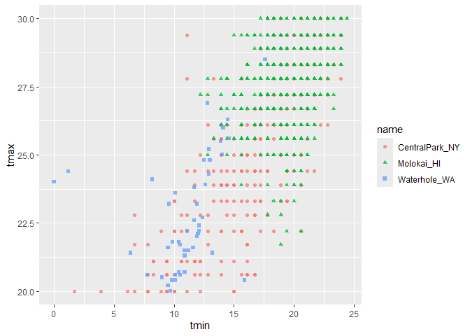
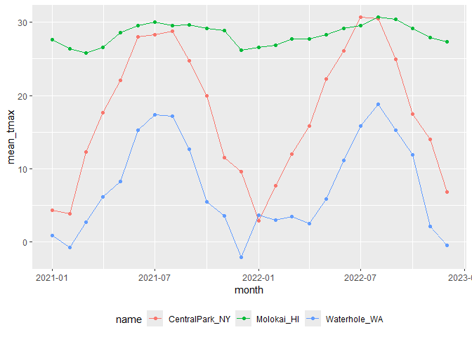

EDA
================
Chenyu Jin
2024-10-03

``` r
library(tidyverse)
```

    ## ── Attaching core tidyverse packages ──────────────────────── tidyverse 2.0.0 ──
    ## ✔ dplyr     1.1.4     ✔ readr     2.1.5
    ## ✔ forcats   1.0.0     ✔ stringr   1.5.1
    ## ✔ ggplot2   3.5.1     ✔ tibble    3.2.1
    ## ✔ lubridate 1.9.3     ✔ tidyr     1.3.1
    ## ✔ purrr     1.0.2     
    ## ── Conflicts ────────────────────────────────────────── tidyverse_conflicts() ──
    ## ✖ dplyr::filter() masks stats::filter()
    ## ✖ dplyr::lag()    masks stats::lag()
    ## ℹ Use the conflicted package (<http://conflicted.r-lib.org/>) to force all conflicts to become errors

``` r
library(ggridges)
```

``` r
weather_df = 
  rnoaa::meteo_pull_monitors(
    c("USW00094728", "USW00022534", "USS0023B17S"),
    var = c("PRCP", "TMIN", "TMAX"), 
    date_min = "2021-01-01",
    date_max = "2022-12-31") |>
  mutate(
    name = case_match(
      id, 
      "USW00094728" ~ "CentralPark_NY", 
      "USW00022534" ~ "Molokai_HI",
      "USS0023B17S" ~ "Waterhole_WA"),
    tmin = tmin / 10,
    tmax = tmax / 10,
    month = floor_date(date, unit = "month"))|>
  select(name, id, everything())
```

    ## using cached file: C:\Users\Thompson\AppData\Local/R/cache/R/rnoaa/noaa_ghcnd/USW00094728.dly

    ## date created (size, mb): 2024-09-26 10:19:45.550838 (8.668)

    ## file min/max dates: 1869-01-01 / 2024-09-30

    ## using cached file: C:\Users\Thompson\AppData\Local/R/cache/R/rnoaa/noaa_ghcnd/USW00022534.dly

    ## date created (size, mb): 2024-09-26 10:20:05.945482 (3.94)

    ## file min/max dates: 1949-10-01 / 2024-09-30

    ## using cached file: C:\Users\Thompson\AppData\Local/R/cache/R/rnoaa/noaa_ghcnd/USS0023B17S.dly

    ## date created (size, mb): 2024-09-26 10:20:12.364819 (1.038)

    ## file min/max dates: 1999-09-01 / 2024-09-30

Initial numeric explorations

``` r
weather_df |> 
  ggplot(aes(x = prcp)) + 
  geom_histogram()
```

    ## `stat_bin()` using `bins = 30`. Pick better value with `binwidth`.

    ## Warning: Removed 15 rows containing non-finite outside the scale range
    ## (`stat_bin()`).

<!-- -->

``` r
weather_df |>
  filter(prcp > 1000)
```

    ## # A tibble: 3 × 7
    ##   name           id          date        prcp  tmax  tmin month     
    ##   <chr>          <chr>       <date>     <dbl> <dbl> <dbl> <date>    
    ## 1 CentralPark_NY USW00094728 2021-08-21  1130  27.8  22.8 2021-08-01
    ## 2 CentralPark_NY USW00094728 2021-09-01  1811  25.6  17.2 2021-09-01
    ## 3 Molokai_HI     USW00022534 2022-12-18  1120  23.3  18.9 2022-12-01

``` r
weather_df |> 
  filter(tmax >= 20, tmax <= 30) |> 
  ggplot(aes(x = tmin, y = tmax, color = name, shape = name)) + 
  geom_point(alpha = .75)
```

<!-- -->

## group_by()

``` r
weather_df |>
  group_by(name, month) |>
  summarize(
    n_obs = n())
```

    ## `summarise()` has grouped output by 'name'. You can override using the
    ## `.groups` argument.

    ## # A tibble: 72 × 3
    ## # Groups:   name [3]
    ##    name           month      n_obs
    ##    <chr>          <date>     <int>
    ##  1 CentralPark_NY 2021-01-01    31
    ##  2 CentralPark_NY 2021-02-01    28
    ##  3 CentralPark_NY 2021-03-01    31
    ##  4 CentralPark_NY 2021-04-01    30
    ##  5 CentralPark_NY 2021-05-01    31
    ##  6 CentralPark_NY 2021-06-01    30
    ##  7 CentralPark_NY 2021-07-01    31
    ##  8 CentralPark_NY 2021-08-01    31
    ##  9 CentralPark_NY 2021-09-01    30
    ## 10 CentralPark_NY 2021-10-01    31
    ## # ℹ 62 more rows

``` r
weather_df |>
  count(name)
```

    ## # A tibble: 3 × 2
    ##   name               n
    ##   <chr>          <int>
    ## 1 CentralPark_NY   730
    ## 2 Molokai_HI       730
    ## 3 Waterhole_WA     730

## 2x2

``` r
weather_df |> 
  drop_na(tmax) |> 
  mutate(
    cold = case_when(
      tmax <  5 ~ "cold",
      tmax >= 5 ~ "not_cold",
      TRUE      ~ ""
  )) |> 
  filter(name != "Molokai_HI") |> 
  group_by(name, cold) |> 
  summarize(count = n())
```

    ## `summarise()` has grouped output by 'name'. You can override using the
    ## `.groups` argument.

    ## # A tibble: 4 × 3
    ## # Groups:   name [2]
    ##   name           cold     count
    ##   <chr>          <chr>    <int>
    ## 1 CentralPark_NY cold        96
    ## 2 CentralPark_NY not_cold   634
    ## 3 Waterhole_WA   cold       319
    ## 4 Waterhole_WA   not_cold   395

``` r
weather_df |> 
  drop_na(tmax) |> 
  mutate(cold = case_when(
    tmax <  5 ~ "cold",
    tmax >= 5 ~ "not_cold",
    TRUE     ~ ""
  )) |> 
  filter(name != "Molokai_HI") |> 
  janitor::tabyl(name, cold)
```

    ##            name cold not_cold
    ##  CentralPark_NY   96      634
    ##    Waterhole_WA  319      395

## General summaries

``` r
weather_df |>
  group_by(month) |>
  summarize(
    mean_tmax = mean(tmax, na.rm = TRUE),
    mean_tmin = mean(tmin, na.rm = TRUE),
    median_tmax = median(tmax, na.rm = TRUE),
    sd_prcp = sd(prcp, na.rm = TRUE))
```

    ## # A tibble: 24 × 5
    ##    month      mean_tmax mean_tmin median_tmax sd_prcp
    ##    <date>         <dbl>     <dbl>       <dbl>   <dbl>
    ##  1 2021-01-01     10.9       5.02         5     113. 
    ##  2 2021-02-01      9.82      3.65         2.8    83.4
    ##  3 2021-03-01     13.7       5.67        12.5   107. 
    ##  4 2021-04-01     16.8       7.58        18.0    37.0
    ##  5 2021-05-01     19.6      10.5         22.2    48.1
    ##  6 2021-06-01     24.3      15.0         28.3    38.6
    ##  7 2021-07-01     25.2      17.1         28.3    96.6
    ##  8 2021-08-01     25.2      17.2         28.3   141. 
    ##  9 2021-09-01     22.4      14.5         24.4   200. 
    ## 10 2021-10-01     18.2      11.5         20.6   112. 
    ## # ℹ 14 more rows

``` r
weather_df |>
  group_by(name, month) |>
  summarize(
    mean_tmax = mean(tmax, na.rm = TRUE),
    median_tmax = median(tmax, na.rm = TRUE))
```

    ## `summarise()` has grouped output by 'name'. You can override using the
    ## `.groups` argument.

    ## # A tibble: 72 × 4
    ## # Groups:   name [3]
    ##    name           month      mean_tmax median_tmax
    ##    <chr>          <date>         <dbl>       <dbl>
    ##  1 CentralPark_NY 2021-01-01      4.27         5  
    ##  2 CentralPark_NY 2021-02-01      3.87         2.8
    ##  3 CentralPark_NY 2021-03-01     12.3         12.2
    ##  4 CentralPark_NY 2021-04-01     17.6         18.0
    ##  5 CentralPark_NY 2021-05-01     22.1         22.2
    ##  6 CentralPark_NY 2021-06-01     28.1         27.8
    ##  7 CentralPark_NY 2021-07-01     28.4         28.3
    ##  8 CentralPark_NY 2021-08-01     28.8         28.3
    ##  9 CentralPark_NY 2021-09-01     24.8         24.4
    ## 10 CentralPark_NY 2021-10-01     19.9         20.6
    ## # ℹ 62 more rows

``` r
weather_df |>
  group_by(name, month) |>
  summarize(across(tmin:prcp, mean))
```

    ## `summarise()` has grouped output by 'name'. You can override using the
    ## `.groups` argument.

    ## # A tibble: 72 × 5
    ## # Groups:   name [3]
    ##    name           month       tmin  tmax  prcp
    ##    <chr>          <date>     <dbl> <dbl> <dbl>
    ##  1 CentralPark_NY 2021-01-01 -1.15  4.27  18.9
    ##  2 CentralPark_NY 2021-02-01 -1.39  3.87  46.6
    ##  3 CentralPark_NY 2021-03-01  3.1  12.3   28.0
    ##  4 CentralPark_NY 2021-04-01  7.48 17.6   22.8
    ##  5 CentralPark_NY 2021-05-01 12.2  22.1   35.7
    ##  6 CentralPark_NY 2021-06-01 18.9  28.1   22.2
    ##  7 CentralPark_NY 2021-07-01 20.6  28.4   90.9
    ##  8 CentralPark_NY 2021-08-01 21.8  28.8   84.5
    ##  9 CentralPark_NY 2021-09-01 17.8  24.8   84.9
    ## 10 CentralPark_NY 2021-10-01 13.4  19.9   43.1
    ## # ℹ 62 more rows

``` r
weather_df |>
  group_by(name, month) |>
  summarize(mean_tmax = mean(tmax, na.rm = TRUE)) |>
  ggplot(aes(x = month, y = mean_tmax, color = name)) + 
    geom_point() + geom_line() + 
    theme(legend.position = "bottom")
```

    ## `summarise()` has grouped output by 'name'. You can override using the
    ## `.groups` argument.

<!-- -->

``` r
weather_df |>
  group_by(name, month) |>
  summarize(mean_tmax = mean(tmax, na.rm = TRUE)) |> 
  pivot_wider(
    names_from = name,
    values_from = mean_tmax) |> 
  knitr::kable(digits = 1)
```

    ## `summarise()` has grouped output by 'name'. You can override using the
    ## `.groups` argument.

| month      | CentralPark_NY | Molokai_HI | Waterhole_WA |
|:-----------|---------------:|-----------:|-------------:|
| 2021-01-01 |            4.3 |       27.6 |          0.8 |
| 2021-02-01 |            3.9 |       26.4 |         -0.8 |
| 2021-03-01 |           12.3 |       25.9 |          2.6 |
| 2021-04-01 |           17.6 |       26.6 |          6.1 |
| 2021-05-01 |           22.1 |       28.6 |          8.2 |
| 2021-06-01 |           28.1 |       29.6 |         15.3 |
| 2021-07-01 |           28.4 |       30.0 |         17.3 |
| 2021-08-01 |           28.8 |       29.5 |         17.2 |
| 2021-09-01 |           24.8 |       29.7 |         12.6 |
| 2021-10-01 |           19.9 |       29.1 |          5.5 |
| 2021-11-01 |           11.5 |       28.8 |          3.5 |
| 2021-12-01 |            9.6 |       26.2 |         -2.1 |
| 2022-01-01 |            2.9 |       26.6 |          3.6 |
| 2022-02-01 |            7.7 |       26.8 |          3.0 |
| 2022-03-01 |           12.0 |       27.7 |          3.4 |
| 2022-04-01 |           15.8 |       27.7 |          2.5 |
| 2022-05-01 |           22.3 |       28.3 |          5.8 |
| 2022-06-01 |           26.1 |       29.2 |         11.1 |
| 2022-07-01 |           30.7 |       29.5 |         15.9 |
| 2022-08-01 |           30.5 |       30.7 |         18.8 |
| 2022-09-01 |           24.9 |       30.4 |         15.2 |
| 2022-10-01 |           17.4 |       29.2 |         11.9 |
| 2022-11-01 |           14.0 |       28.0 |          2.1 |
| 2022-12-01 |            6.8 |       27.3 |         -0.5 |
