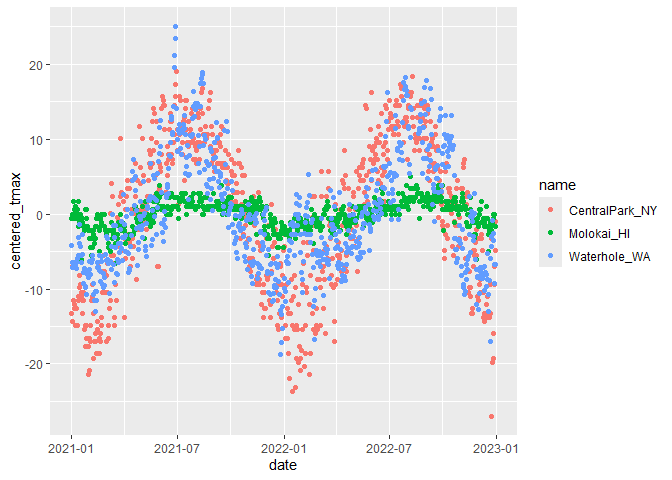

EDA
================
Chenyu Jin
2024-10-03

``` r
library(tidyverse)
```

    ## ── Attaching core tidyverse packages ──────────────────────── tidyverse 2.0.0 ──
    ## ✔ dplyr     1.1.4     ✔ readr     2.1.5
    ## ✔ forcats   1.0.0     ✔ stringr   1.5.1
    ## ✔ ggplot2   3.5.1     ✔ tibble    3.2.1
    ## ✔ lubridate 1.9.3     ✔ tidyr     1.3.1
    ## ✔ purrr     1.0.2     
    ## ── Conflicts ────────────────────────────────────────── tidyverse_conflicts() ──
    ## ✖ dplyr::filter() masks stats::filter()
    ## ✖ dplyr::lag()    masks stats::lag()
    ## ℹ Use the conflicted package (<http://conflicted.r-lib.org/>) to force all conflicts to become errors

``` r
library(ggridges)
```

``` r
weather_df = 
  rnoaa::meteo_pull_monitors(
    c("USW00094728", "USW00022534", "USS0023B17S"),
    var = c("PRCP", "TMIN", "TMAX"), 
    date_min = "2021-01-01",
    date_max = "2022-12-31") |>
  mutate(
    name = case_match(
      id, 
      "USW00094728" ~ "CentralPark_NY", 
      "USW00022534" ~ "Molokai_HI",
      "USS0023B17S" ~ "Waterhole_WA"),
    tmin = tmin / 10,
    tmax = tmax / 10,
    month = floor_date(date, unit = "month"))|>
  select(name, id, everything())
```

    ## using cached file: C:\Users\Thompson\AppData\Local/R/cache/R/rnoaa/noaa_ghcnd/USW00094728.dly

    ## date created (size, mb): 2024-09-26 10:19:45.550838 (8.668)

    ## file min/max dates: 1869-01-01 / 2024-09-30

    ## using cached file: C:\Users\Thompson\AppData\Local/R/cache/R/rnoaa/noaa_ghcnd/USW00022534.dly

    ## date created (size, mb): 2024-09-26 10:20:05.945482 (3.94)

    ## file min/max dates: 1949-10-01 / 2024-09-30

    ## using cached file: C:\Users\Thompson\AppData\Local/R/cache/R/rnoaa/noaa_ghcnd/USS0023B17S.dly

    ## date created (size, mb): 2024-09-26 10:20:12.364819 (1.038)

    ## file min/max dates: 1999-09-01 / 2024-09-30

Initial numeric explorations

``` r
weather_df |> 
  ggplot(aes(x = prcp)) + 
  geom_histogram()
```

    ## `stat_bin()` using `bins = 30`. Pick better value with `binwidth`.

    ## Warning: Removed 15 rows containing non-finite outside the scale range
    ## (`stat_bin()`).

<!-- -->

``` r
weather_df |>
  filter(prcp > 1000)
```

    ## # A tibble: 3 × 7
    ##   name           id          date        prcp  tmax  tmin month     
    ##   <chr>          <chr>       <date>     <dbl> <dbl> <dbl> <date>    
    ## 1 CentralPark_NY USW00094728 2021-08-21  1130  27.8  22.8 2021-08-01
    ## 2 CentralPark_NY USW00094728 2021-09-01  1811  25.6  17.2 2021-09-01
    ## 3 Molokai_HI     USW00022534 2022-12-18  1120  23.3  18.9 2022-12-01

``` r
weather_df |> 
  filter(tmax >= 20, tmax <= 30) |> 
  ggplot(aes(x = tmin, y = tmax, color = name, shape = name)) + 
  geom_point(alpha = .75)
```

<!-- -->

## `group_by()`

``` r
weather_df |>
  group_by(name, month) |>
  summarize(
    n_obs = n())
```

    ## `summarise()` has grouped output by 'name'. You can override using the
    ## `.groups` argument.

    ## # A tibble: 72 × 3
    ## # Groups:   name [3]
    ##    name           month      n_obs
    ##    <chr>          <date>     <int>
    ##  1 CentralPark_NY 2021-01-01    31
    ##  2 CentralPark_NY 2021-02-01    28
    ##  3 CentralPark_NY 2021-03-01    31
    ##  4 CentralPark_NY 2021-04-01    30
    ##  5 CentralPark_NY 2021-05-01    31
    ##  6 CentralPark_NY 2021-06-01    30
    ##  7 CentralPark_NY 2021-07-01    31
    ##  8 CentralPark_NY 2021-08-01    31
    ##  9 CentralPark_NY 2021-09-01    30
    ## 10 CentralPark_NY 2021-10-01    31
    ## # ℹ 62 more rows

``` r
weather_df |>
  count(name)
```

    ## # A tibble: 3 × 2
    ##   name               n
    ##   <chr>          <int>
    ## 1 CentralPark_NY   730
    ## 2 Molokai_HI       730
    ## 3 Waterhole_WA     730

## 2x2

``` r
weather_df |> 
  drop_na(tmax) |> 
  mutate(
    cold = case_when(
      tmax <  5 ~ "cold",
      tmax >= 5 ~ "not_cold",
      TRUE      ~ ""
  )) |> 
  filter(name != "Molokai_HI") |> 
  group_by(name, cold) |> 
  summarize(count = n())
```

    ## `summarise()` has grouped output by 'name'. You can override using the
    ## `.groups` argument.

    ## # A tibble: 4 × 3
    ## # Groups:   name [2]
    ##   name           cold     count
    ##   <chr>          <chr>    <int>
    ## 1 CentralPark_NY cold        96
    ## 2 CentralPark_NY not_cold   634
    ## 3 Waterhole_WA   cold       319
    ## 4 Waterhole_WA   not_cold   395

``` r
weather_df |> 
  drop_na(tmax) |> 
  mutate(cold = case_when(
    tmax <  5 ~ "cold",
    tmax >= 5 ~ "not_cold",
    TRUE     ~ ""
  )) |> 
  filter(name != "Molokai_HI") |> 
  janitor::tabyl(name, cold)
```

    ##            name cold not_cold
    ##  CentralPark_NY   96      634
    ##    Waterhole_WA  319      395

## General summaries

``` r
weather_df |>
  group_by(month) |>
  summarize(
    mean_tmax = mean(tmax, na.rm = TRUE),
    mean_tmin = mean(tmin, na.rm = TRUE),
    median_tmax = median(tmax, na.rm = TRUE),
    sd_prcp = sd(prcp, na.rm = TRUE))
```

    ## # A tibble: 24 × 5
    ##    month      mean_tmax mean_tmin median_tmax sd_prcp
    ##    <date>         <dbl>     <dbl>       <dbl>   <dbl>
    ##  1 2021-01-01     10.9       5.02         5     113. 
    ##  2 2021-02-01      9.82      3.65         2.8    83.4
    ##  3 2021-03-01     13.7       5.67        12.5   107. 
    ##  4 2021-04-01     16.8       7.58        18.0    37.0
    ##  5 2021-05-01     19.6      10.5         22.2    48.1
    ##  6 2021-06-01     24.3      15.0         28.3    38.6
    ##  7 2021-07-01     25.2      17.1         28.3    96.6
    ##  8 2021-08-01     25.2      17.2         28.3   141. 
    ##  9 2021-09-01     22.4      14.5         24.4   200. 
    ## 10 2021-10-01     18.2      11.5         20.6   112. 
    ## # ℹ 14 more rows

``` r
weather_df |>
  group_by(name, month) |>
  summarize(
    mean_tmax = mean(tmax, na.rm = TRUE),
    median_tmax = median(tmax, na.rm = TRUE))
```

    ## `summarise()` has grouped output by 'name'. You can override using the
    ## `.groups` argument.

    ## # A tibble: 72 × 4
    ## # Groups:   name [3]
    ##    name           month      mean_tmax median_tmax
    ##    <chr>          <date>         <dbl>       <dbl>
    ##  1 CentralPark_NY 2021-01-01      4.27         5  
    ##  2 CentralPark_NY 2021-02-01      3.87         2.8
    ##  3 CentralPark_NY 2021-03-01     12.3         12.2
    ##  4 CentralPark_NY 2021-04-01     17.6         18.0
    ##  5 CentralPark_NY 2021-05-01     22.1         22.2
    ##  6 CentralPark_NY 2021-06-01     28.1         27.8
    ##  7 CentralPark_NY 2021-07-01     28.4         28.3
    ##  8 CentralPark_NY 2021-08-01     28.8         28.3
    ##  9 CentralPark_NY 2021-09-01     24.8         24.4
    ## 10 CentralPark_NY 2021-10-01     19.9         20.6
    ## # ℹ 62 more rows

``` r
weather_df |>
  group_by(name, month) |>
  summarize(across(tmin:prcp, mean))
```

    ## `summarise()` has grouped output by 'name'. You can override using the
    ## `.groups` argument.

    ## # A tibble: 72 × 5
    ## # Groups:   name [3]
    ##    name           month       tmin  tmax  prcp
    ##    <chr>          <date>     <dbl> <dbl> <dbl>
    ##  1 CentralPark_NY 2021-01-01 -1.15  4.27  18.9
    ##  2 CentralPark_NY 2021-02-01 -1.39  3.87  46.6
    ##  3 CentralPark_NY 2021-03-01  3.1  12.3   28.0
    ##  4 CentralPark_NY 2021-04-01  7.48 17.6   22.8
    ##  5 CentralPark_NY 2021-05-01 12.2  22.1   35.7
    ##  6 CentralPark_NY 2021-06-01 18.9  28.1   22.2
    ##  7 CentralPark_NY 2021-07-01 20.6  28.4   90.9
    ##  8 CentralPark_NY 2021-08-01 21.8  28.8   84.5
    ##  9 CentralPark_NY 2021-09-01 17.8  24.8   84.9
    ## 10 CentralPark_NY 2021-10-01 13.4  19.9   43.1
    ## # ℹ 62 more rows

``` r
weather_df |>
  group_by(name, month) |>
  summarize(mean_tmax = mean(tmax, na.rm = TRUE)) |>
  ggplot(aes(x = month, y = mean_tmax, color = name)) + 
    geom_point() + geom_line() + 
    theme(legend.position = "bottom")
```

    ## `summarise()` has grouped output by 'name'. You can override using the
    ## `.groups` argument.

<!-- -->

``` r
weather_df |>
  group_by(name, month) |>
  summarize(mean_tmax = mean(tmax, na.rm = TRUE)) |> 
  pivot_wider(
    names_from = name,
    values_from = mean_tmax) |> 
  knitr::kable(digits = 1)
```

    ## `summarise()` has grouped output by 'name'. You can override using the
    ## `.groups` argument.

| month      | CentralPark_NY | Molokai_HI | Waterhole_WA |
|:-----------|---------------:|-----------:|-------------:|
| 2021-01-01 |            4.3 |       27.6 |          0.8 |
| 2021-02-01 |            3.9 |       26.4 |         -0.8 |
| 2021-03-01 |           12.3 |       25.9 |          2.6 |
| 2021-04-01 |           17.6 |       26.6 |          6.1 |
| 2021-05-01 |           22.1 |       28.6 |          8.2 |
| 2021-06-01 |           28.1 |       29.6 |         15.3 |
| 2021-07-01 |           28.4 |       30.0 |         17.3 |
| 2021-08-01 |           28.8 |       29.5 |         17.2 |
| 2021-09-01 |           24.8 |       29.7 |         12.6 |
| 2021-10-01 |           19.9 |       29.1 |          5.5 |
| 2021-11-01 |           11.5 |       28.8 |          3.5 |
| 2021-12-01 |            9.6 |       26.2 |         -2.1 |
| 2022-01-01 |            2.9 |       26.6 |          3.6 |
| 2022-02-01 |            7.7 |       26.8 |          3.0 |
| 2022-03-01 |           12.0 |       27.7 |          3.4 |
| 2022-04-01 |           15.8 |       27.7 |          2.5 |
| 2022-05-01 |           22.3 |       28.3 |          5.8 |
| 2022-06-01 |           26.1 |       29.2 |         11.1 |
| 2022-07-01 |           30.7 |       29.5 |         15.9 |
| 2022-08-01 |           30.5 |       30.7 |         18.8 |
| 2022-09-01 |           24.9 |       30.4 |         15.2 |
| 2022-10-01 |           17.4 |       29.2 |         11.9 |
| 2022-11-01 |           14.0 |       28.0 |          2.1 |
| 2022-12-01 |            6.8 |       27.3 |         -0.5 |

## Grouped `mutate`

``` r
weather_df |>
  group_by(name) |>
  mutate(
    mean_tmax = mean(tmax, na.rm = TRUE),
    centered_tmax = tmax - mean_tmax) |> 
  ggplot(aes(x = date, y = centered_tmax, color = name)) + 
    geom_point() 
```

    ## Warning: Removed 17 rows containing missing values or values outside the scale range
    ## (`geom_point()`).

<!-- -->

## Window functions

``` r
weather_df |>
  group_by(name) |>
  mutate(
    temp_ranking = min_rank(desc(tmax))
    ) |>
  filter(temp_ranking < 4)
```

    ## # A tibble: 16 × 8
    ## # Groups:   name [3]
    ##    name           id        date        prcp  tmax  tmin month      temp_ranking
    ##    <chr>          <chr>     <date>     <dbl> <dbl> <dbl> <date>            <int>
    ##  1 CentralPark_NY USW00094… 2021-06-29     0  35    25.6 2021-06-01            3
    ##  2 CentralPark_NY USW00094… 2021-06-30   165  36.7  22.8 2021-06-01            1
    ##  3 CentralPark_NY USW00094… 2022-07-20     0  35    25.6 2022-07-01            3
    ##  4 CentralPark_NY USW00094… 2022-07-23     0  35    25.6 2022-07-01            3
    ##  5 CentralPark_NY USW00094… 2022-07-24     0  35    26.1 2022-07-01            3
    ##  6 CentralPark_NY USW00094… 2022-08-09     8  36.1  25.6 2022-08-01            2
    ##  7 Molokai_HI     USW00022… 2021-05-31     0  32.2  17.2 2021-05-01            2
    ##  8 Molokai_HI     USW00022… 2021-09-16     0  32.2  21.1 2021-09-01            2
    ##  9 Molokai_HI     USW00022… 2022-07-30     0  32.2  22.2 2022-07-01            2
    ## 10 Molokai_HI     USW00022… 2022-08-06     0  33.3  20.6 2022-08-01            1
    ## 11 Molokai_HI     USW00022… 2022-08-17     0  32.2  21.1 2022-08-01            2
    ## 12 Molokai_HI     USW00022… 2022-09-24     0  32.2  22.2 2022-09-01            2
    ## 13 Molokai_HI     USW00022… 2022-09-30     0  32.2  20   2022-09-01            2
    ## 14 Waterhole_WA   USS0023B… 2021-06-27     0  28.5  17.6 2021-06-01            3
    ## 15 Waterhole_WA   USS0023B… 2021-06-28     0  30.8  20.7 2021-06-01            2
    ## 16 Waterhole_WA   USS0023B… 2021-06-29     0  32.4  17.6 2021-06-01            1

``` r
weather_df |>
  group_by(name) |>
  mutate(
    temp_change = tmax - lag(tmax)
    ) |>
  filter(min_rank(temp_change) < 3)
```

    ## # A tibble: 6 × 8
    ## # Groups:   name [3]
    ##   name           id          date        prcp  tmax  tmin month      temp_change
    ##   <chr>          <chr>       <date>     <dbl> <dbl> <dbl> <date>           <dbl>
    ## 1 CentralPark_NY USW00094728 2022-02-24     0   1.7  -1.6 2022-02-01       -18.3
    ## 2 CentralPark_NY USW00094728 2022-12-24     0  -9.3 -13.8 2022-12-01       -23.7
    ## 3 Molokai_HI     USW00022534 2021-01-18   234  22.2  19.4 2021-01-01        -5.6
    ## 4 Molokai_HI     USW00022534 2022-11-28    56  22.2  20.6 2022-11-01        -5  
    ## 5 Waterhole_WA   USS0023B17S 2021-06-30     0  21.5  10.9 2021-06-01       -10.9
    ## 6 Waterhole_WA   USS0023B17S 2022-06-28     0  12.4   5.7 2022-06-01       -11.2

``` r
weather_df |>
  group_by(name) |>
  mutate(
    temp_change = tmax - lag(tmax)) |>
  summarize(
    temp_change_sd = sd(temp_change, na.rm = TRUE),
    temp_change_max = max(temp_change, na.rm = TRUE))
```

    ## # A tibble: 3 × 3
    ##   name           temp_change_sd temp_change_max
    ##   <chr>                   <dbl>           <dbl>
    ## 1 CentralPark_NY           4.43            12.2
    ## 2 Molokai_HI               1.24             5.6
    ## 3 Waterhole_WA             3.04            11.1

## Learning Assessment 1:

``` r
pulse_data = 
  haven::read_sas("data/public_pulse_data.sas7bdat") |>
  janitor::clean_names() |>
  pivot_longer(
    bdi_score_bl:bdi_score_12m,
    names_to = "visit", 
    names_prefix = "bdi_score_",
    values_to = "bdi") |>
  select(id, visit, everything()) |>
  mutate(
    visit = replace(visit, visit == "bl", "00m"),
    visit = factor(visit, levels = str_c(c("00", "01", "06", "12"), "m"))) |>
  arrange(id, visit)
```

``` r
pulse_data |> 
  group_by(visit) |> 
  summarize(
    mean_bdi = mean(bdi, na.rm = TRUE),
    median_bdi = median(bdi, na.rm = TRUE)) |> 
  knitr::kable(digits = 3)
```

| visit | mean_bdi | median_bdi |
|:------|---------:|-----------:|
| 00m   |    7.995 |          6 |
| 01m   |    6.046 |          4 |
| 06m   |    5.672 |          4 |
| 12m   |    6.097 |          4 |

## Learning Assessment 2:

``` r
pup_data = 
  read_csv("data/FAS_pups.csv") |>
  janitor::clean_names() |>
  mutate(sex = recode(sex, `1` = "male", `2` = "female")) 
```

    ## Rows: 313 Columns: 6
    ## ── Column specification ────────────────────────────────────────────────────────
    ## Delimiter: ","
    ## chr (2): Litter Number, PD ears
    ## dbl (4): Sex, PD eyes, PD pivot, PD walk
    ## 
    ## ℹ Use `spec()` to retrieve the full column specification for this data.
    ## ℹ Specify the column types or set `show_col_types = FALSE` to quiet this message.

``` r
litter_data = 
  read_csv("data/FAS_litters.csv") |>
  janitor::clean_names() |>
  separate(group, into = c("dose", "day_of_tx"), sep = 3)
```

    ## Rows: 49 Columns: 8
    ## ── Column specification ────────────────────────────────────────────────────────
    ## Delimiter: ","
    ## chr (4): Group, Litter Number, GD0 weight, GD18 weight
    ## dbl (4): GD of Birth, Pups born alive, Pups dead @ birth, Pups survive
    ## 
    ## ℹ Use `spec()` to retrieve the full column specification for this data.
    ## ℹ Specify the column types or set `show_col_types = FALSE` to quiet this message.

``` r
fas_data = left_join(pup_data, litter_data, by = "litter_number") 

fas_data |> 
  group_by(dose, day_of_tx) |> 
  drop_na(dose) |> 
  summarize(mean_pivot = mean(pd_pivot, na.rm = TRUE)) |> 
  pivot_wider(
    names_from = dose, 
    values_from = mean_pivot) |> 
  knitr::kable(digits = 3)
```

    ## `summarise()` has grouped output by 'dose'. You can override using the
    ## `.groups` argument.

| day_of_tx |   Con |   Low |   Mod |
|:----------|------:|------:|------:|
| 7         | 7.000 | 7.939 | 6.984 |
| 8         | 6.236 | 7.721 | 7.042 |
