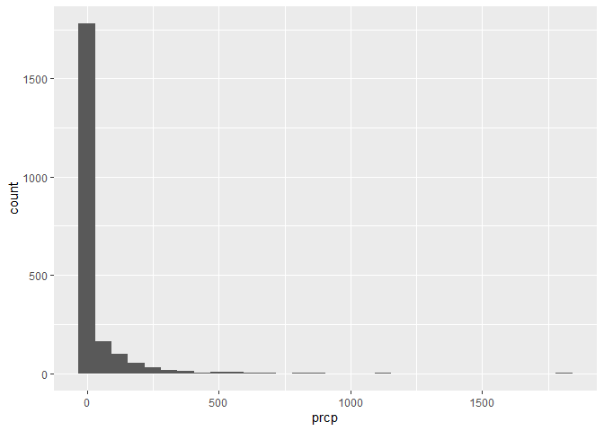

EDA
================
Chenyu Jin
2024-10-03

``` r
library(tidyverse)
```

    ## ── Attaching core tidyverse packages ──────────────────────── tidyverse 2.0.0 ──
    ## ✔ dplyr     1.1.4     ✔ readr     2.1.5
    ## ✔ forcats   1.0.0     ✔ stringr   1.5.1
    ## ✔ ggplot2   3.5.1     ✔ tibble    3.2.1
    ## ✔ lubridate 1.9.3     ✔ tidyr     1.3.1
    ## ✔ purrr     1.0.2     
    ## ── Conflicts ────────────────────────────────────────── tidyverse_conflicts() ──
    ## ✖ dplyr::filter() masks stats::filter()
    ## ✖ dplyr::lag()    masks stats::lag()
    ## ℹ Use the conflicted package (<http://conflicted.r-lib.org/>) to force all conflicts to become errors

``` r
library(ggridges)
```

``` r
weather_df = 
  rnoaa::meteo_pull_monitors(
    c("USW00094728", "USW00022534", "USS0023B17S"),
    var = c("PRCP", "TMIN", "TMAX"), 
    date_min = "2021-01-01",
    date_max = "2022-12-31") |>
  mutate(
    name = case_match(
      id, 
      "USW00094728" ~ "CentralPark_NY", 
      "USW00022534" ~ "Molokai_HI",
      "USS0023B17S" ~ "Waterhole_WA"),
    tmin = tmin / 10,
    tmax = tmax / 10,
    month = floor_date(date, unit = "month"))|>
  select(name, id, everything())
```

    ## using cached file: C:\Users\Thompson\AppData\Local/R/cache/R/rnoaa/noaa_ghcnd/USW00094728.dly

    ## date created (size, mb): 2024-09-26 10:19:45.550838 (8.668)

    ## file min/max dates: 1869-01-01 / 2024-09-30

    ## using cached file: C:\Users\Thompson\AppData\Local/R/cache/R/rnoaa/noaa_ghcnd/USW00022534.dly

    ## date created (size, mb): 2024-09-26 10:20:05.945482 (3.94)

    ## file min/max dates: 1949-10-01 / 2024-09-30

    ## using cached file: C:\Users\Thompson\AppData\Local/R/cache/R/rnoaa/noaa_ghcnd/USS0023B17S.dly

    ## date created (size, mb): 2024-09-26 10:20:12.364819 (1.038)

    ## file min/max dates: 1999-09-01 / 2024-09-30

Initial numeric explorations

``` r
weather_df |> 
  ggplot(aes(x = prcp)) + 
  geom_histogram()
```

    ## `stat_bin()` using `bins = 30`. Pick better value with `binwidth`.

    ## Warning: Removed 15 rows containing non-finite outside the scale range
    ## (`stat_bin()`).

<!-- -->

``` r
weather_df |>
  filter(prcp > 1000)
```

    ## # A tibble: 3 × 7
    ##   name           id          date        prcp  tmax  tmin month     
    ##   <chr>          <chr>       <date>     <dbl> <dbl> <dbl> <date>    
    ## 1 CentralPark_NY USW00094728 2021-08-21  1130  27.8  22.8 2021-08-01
    ## 2 CentralPark_NY USW00094728 2021-09-01  1811  25.6  17.2 2021-09-01
    ## 3 Molokai_HI     USW00022534 2022-12-18  1120  23.3  18.9 2022-12-01

``` r
weather_df |> 
  filter(tmax >= 20, tmax <= 30) |> 
  ggplot(aes(x = tmin, y = tmax, color = name, shape = name)) + 
  geom_point(alpha = .75)
```

<!-- -->

## group_by()

``` r
weather_df |>
  group_by(name, month) |>
  summarize(
    n_obs = n())
```

    ## `summarise()` has grouped output by 'name'. You can override using the
    ## `.groups` argument.

    ## # A tibble: 72 × 3
    ## # Groups:   name [3]
    ##    name           month      n_obs
    ##    <chr>          <date>     <int>
    ##  1 CentralPark_NY 2021-01-01    31
    ##  2 CentralPark_NY 2021-02-01    28
    ##  3 CentralPark_NY 2021-03-01    31
    ##  4 CentralPark_NY 2021-04-01    30
    ##  5 CentralPark_NY 2021-05-01    31
    ##  6 CentralPark_NY 2021-06-01    30
    ##  7 CentralPark_NY 2021-07-01    31
    ##  8 CentralPark_NY 2021-08-01    31
    ##  9 CentralPark_NY 2021-09-01    30
    ## 10 CentralPark_NY 2021-10-01    31
    ## # ℹ 62 more rows

``` r
weather_df |>
  count(name)
```

    ## # A tibble: 3 × 2
    ##   name               n
    ##   <chr>          <int>
    ## 1 CentralPark_NY   730
    ## 2 Molokai_HI       730
    ## 3 Waterhole_WA     730

## 2x2

``` r
weather_df |> 
  drop_na(tmax) |> 
  mutate(
    cold = case_when(
      tmax <  5 ~ "cold",
      tmax >= 5 ~ "not_cold",
      TRUE      ~ ""
  )) |> 
  filter(name != "Molokai_HI") |> 
  group_by(name, cold) |> 
  summarize(count = n())
```

    ## `summarise()` has grouped output by 'name'. You can override using the
    ## `.groups` argument.

    ## # A tibble: 4 × 3
    ## # Groups:   name [2]
    ##   name           cold     count
    ##   <chr>          <chr>    <int>
    ## 1 CentralPark_NY cold        96
    ## 2 CentralPark_NY not_cold   634
    ## 3 Waterhole_WA   cold       319
    ## 4 Waterhole_WA   not_cold   395

``` r
weather_df |> 
  drop_na(tmax) |> 
  mutate(cold = case_when(
    tmax <  5 ~ "cold",
    tmax >= 5 ~ "not_cold",
    TRUE     ~ ""
  )) |> 
  filter(name != "Molokai_HI") |> 
  janitor::tabyl(name, cold)
```

    ##            name cold not_cold
    ##  CentralPark_NY   96      634
    ##    Waterhole_WA  319      395

## General summaries
